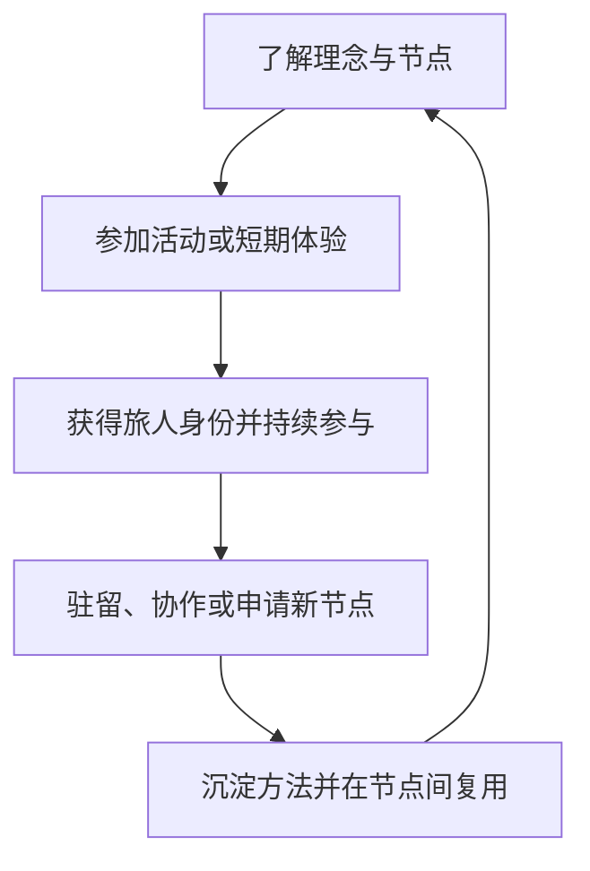
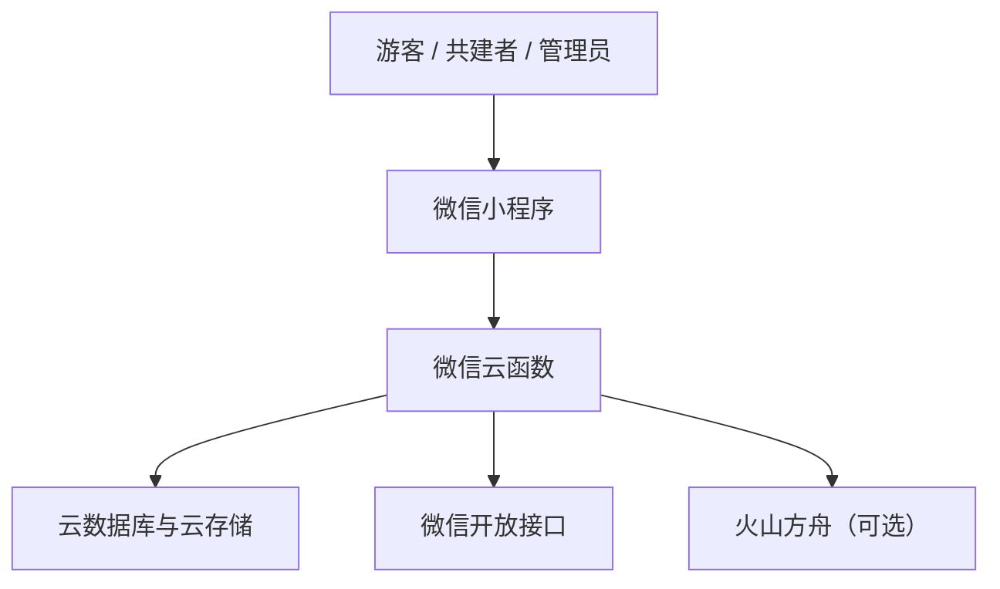

# 归山村落 · 新村落文明实践

> 不是逃离城市，是建立另一种文明的参照系。

这是一个把“对外微信小程序”和“新村落文明生态资料”放在一起的公开仓库。代码负责连接内容、节点、活动、旅人身份与共建入口；文档负责说明我们为什么做、生态怎样形成闭环，以及教育、分配和治理机制仍有哪些待验证的问题。

本仓库是可继续开发的工程快照，不是已经配置好的线上服务。生产 AppID、云环境 ID、订阅模板 ID、API Key 和私人联系电话均未公开。

## 这个项目在做什么

归山村落尝试以真实的土地、食物、劳动和人际协作为基础，建立一种可以体验、驻留、学习和共同建设的山野生活网络。它不把城市与乡村设成对立面，而是希望给城市生活增加一个可抵达、可验证、可长期参与的“地面系统”。

生态由六个互相咬合的模块构成：

| 模块 | 角色 | 主要内容 |
| --- | --- | --- |
| 旅 | 入口 | 短住、活动、山野体验，让陌生人先真实到场 |
| 养 | 日常 | 饮食、作息、自然环境与适度劳动形成的生活节律 |
| 教 | 长期能力 | 在真实生产生活中发展观察、判断、协作和迁移能力 |
| 农 | 物质基础 | 土地维护、生态种植、食材与部分课程场景 |
| 医 | 健康支持 | 由合规、具备相应资质的专业人员提供健康服务 |
| 文 | 精神内核 | 地方文化、节气、传统知识与共同生活的价值表达 |

更完整的整理见 [生态总览](docs/ECOSYSTEM_OVERVIEW.md)；原始愿景、教育与治理讨论稿见 [文档导航](docs/README.md)。

## 从体验到共建



小程序里的近期产品路径可以概括为四个入口：先来住、学一点、认一份、留下位置。优先复用已有的内容、活动报名和身份体系，再根据真实使用情况决定是否开发任务、积分或认养等新系统。

## 小程序能力

- 归山首页：理念入口、节点筛选、活动和山野近况。
- 节点网络：节点介绍、卫星地图、开放活动与内容。
- 活动报名：单次或周期活动、未来场次、名额、取消报名和可选订阅提醒。
- 旅人证：个人资料、参与记录、山野章与分级角色。
- 山野记录：只对经运营方授权的成员开放发布，普通访客仅浏览和报名。
- 加入与共建：驻留、共创伙伴、节点申请和社群入口。
- 分级后台：节点、活动、内容、分类、成员、报名与申请管理。
- AI 向导：基于现有节点、活动和内容做有限范围推荐；未配置模型时自动不可用。

## 两套系统的边界

| 对外小程序（本仓库） | 内部运营系统（不在本仓库） |
| --- | --- |
| 面向游客、旅人和潜在共建者 | 面向实际运营成员 |
| 理念、节点、内容、活动、报名、公开身份 | 库存、采购、领料、任务、工时、金库等内部流程 |
| 互动等级只表达参与关系 | 劳动记录、分配和治理需要独立规则与凭证 |
| 不能因为消费或互动自动获得股权、分红或治理权 | 由组织章程、合同和适用法律决定权利义务 |

两套系统可以在人工审核后交接人员，但不要共用“积分即股权”之类的含混规则，也不要把公开互动数据直接当作内部劳动凭证。

## 技术架构



- 客户端：原生微信小程序，位于 `miniprogram/`。
- 服务端：微信云开发云函数，位于 `cloudfunctions/`。
- 数据：云数据库与云存储；代码使用 `DYNAMIC_CURRENT_ENV`，不绑定公开云环境 ID。
- 富文本：内置 `mp-html` 组件，并在保存云函数中做标签、事件和危险协议白名单清洗。
- AI：`aiGuide` 和 `recognizePhoto` 可选接入火山方舟 Ark。

## 仓库结构

```text
.
├── miniprogram/                 # 小程序页面、组件、样式与客户端配置
├── cloudfunctions/              # 51 个云函数目录
├── docs/
│   ├── ECOSYSTEM_OVERVIEW.md    # 生态愿景的整理版总览
│   ├── vision/                  # 愿景与产品路径讨论稿
│   ├── education/               # 教育执行与职业结构资料
│   ├── governance/              # 分配与治理讨论稿
│   ├── product/                 # 小程序技术和运营交接说明
│   └── assets/                  # 可阅读的原始资料附件
├── project.config.json          # 使用 touristappid 的公开项目配置
├── project.private.config.example.json
├── .env.example
└── uploadCloudFunction.sh       # 单个云函数部署辅助脚本
```

## 本地导入

### 1. 准备环境

- 安装微信开发者工具。
- 准备自己的微信小程序 AppID，并开通云开发环境。
- 克隆或下载本仓库，用微信开发者工具导入仓库根目录。

公开的 `project.config.json` 使用 `touristappid`，可以避免把生产 AppID 提交到仓库。需要真机和云能力时，复制本地私有配置：

```bash
cp project.private.config.example.json project.private.config.json
```

将 `project.private.config.json` 里的 `appid` 改成自己的 AppID。该文件已在 `.gitignore` 中，不会被正常提交。

### 2. 建立云环境

客户端和云函数均使用当前动态环境，不需要把真实云环境 ID 写入源码。请在微信开发者工具中选择自己的云环境，再部署所需云函数。

首次部署前至少创建这些集合：

| 集合 | 用途 |
| --- | --- |
| `users`、`roles` | 用户资料与分级权限 |
| `venues`、`categories` | 节点与动态分类 |
| `activities`、`enrolls` | 活动与按场次报名 |
| `contents`、`pages` | 节点内容与理念页 |
| `records`、`joins` | 山野记录与加入意向 |
| `uploads` | 云文件使用台账 |
| `counters` | 维护脚本使用的序号计数 |

集合权限不要直接照搬测试环境；应按“客户端最小权限、写操作走云函数”的原则配置，并在发布前重新核对。

### 3. 初始化角色与管理员

1. 先部署 `login`，运行一次小程序，让自己的用户记录进入 `users`。
2. 部署并调用一次 `seedRoles`，初始化角色表；该函数可重复运行。
3. 在云数据库中把首位管理员的 `roles` 设置为：

```json
[{ "roleKey": "chief", "venueId": "" }]
```

4. 再部署节点、内容、活动和后台相关云函数，通过管理页面补齐初始数据。

`resetMembers` 是会批量清空其他成员角色的一次性维护函数；普通部署不要调用。`cleanOrphans` 默认只生成报告，只有传入 `confirm: true` 才会删除云文件。

## 配置项

### 本地部署变量

复制 `.env.example` 为 `.env`。根目录 `.env` 只给部署脚本使用，不会自动上传到云函数：

| 变量 | 用途 |
| --- | --- |
| `WECHAT_CLI_PATH` | 微信开发者工具 CLI 的绝对路径 |
| `WECHAT_CLOUD_ENV_ID` | 要部署到的云环境 ID |
| `PROJECT_PATH` | 项目绝对路径；不填时使用仓库根目录 |

部署单个云函数：

```bash
./uploadCloudFunction.sh login
```

也可以直接在微信开发者工具里逐个选择“上传并部署：云端安装依赖”。

### 云函数环境变量

这些值应在对应云函数的环境变量中配置，不要写入源码或提交 `.env`：

| 变量 | 配置到 | 是否必需 |
| --- | --- | --- |
| `ARK_API_KEY` | `aiGuide`、`recognizePhoto` | 仅启用 AI 时 |
| `ARK_MODEL` | `aiGuide` | 仅启用 AI 向导时 |
| `ARK_VISION_MODEL` | `recognizePhoto` | 仅启用图片识别时 |
| `SUBSCRIBE_TEMPLATE_ID` | `getActivitySession`、`remindEnrolls` | 仅启用报名提醒时 |

未配置 `SUBSCRIBE_TEMPLATE_ID` 时仍可报名，只是不请求订阅消息授权，也不会发送提醒。

### 公开联系方式

`miniprogram/config.js` 的 `publicContacts` 默认为空，因此公开副本不会显示私人电话。若要展示业务联系电话，可填写：

```js
publicContacts: [
  { name: '联系人', phone: '填写公开业务电话' }
]
```

小程序客户端中的任何配置都可以被最终用户读取，所以这里不能存放密钥或只应内部可见的信息。

## 安全与合规说明

- 仓库不包含真实 AppID、云环境 ID、订阅模板 ID、API Key、个人手机号或本机绝对路径。
- 用户输入的富文本在云函数侧做白名单清洗；仍应定期审查允许的标签和属性。
- 普通注册用户没有公开发布入口；内容发布需运营方授予角色，并经过文字/图片安全检测。
- 角色权限采用“前端隐藏入口 + 云函数再次校验”的双层方式；不要只依赖前端判断。
- 云函数环境变量是按函数分别配置的，不会在不同函数间自动共享。
- `cloud://` 文件 ID 在展示前需要转换成临时 HTTPS 地址；不要把临时地址写回数据库。

## 文档入口

- [生态总览](docs/ECOSYSTEM_OVERVIEW.md)
- [文档导航](docs/README.md)
- [新村落文明](docs/vision/新村落文明.md)
- [山野生活适应计划](docs/vision/山野生活适应计划.md)
- [生态村教育执行方案](docs/education/生态村教育执行方案.md)
- [分配机制设计说明](docs/governance/分配机制设计说明.md)
- [对外小程序项目说明](docs/product/对外小程序项目说明.md)
- [《新村落文明》PDF](docs/assets/新村落文明.pdf)

## 重要边界

- 本项目中的健康、教育、分配和治理内容是实践设想或讨论稿，不构成医疗建议、学历教育承诺、投资邀约、股权承诺或法律意见。
- 医疗相关服务必须由具备相应资质的主体和人员依法开展；紧急或明确疾病问题应及时就医。
- 分配机制在采用前应由参与者充分协商，并由法律、财税等专业人员审核后形成正式文件。
- 项目当前没有设置仓库级开源许可证。公开可见不等于自动授权复制、修改或商用；如需复用，请先与权利人确认。第三方 `mp-html` 组件保留了原项目的作者与 MIT 许可声明。
